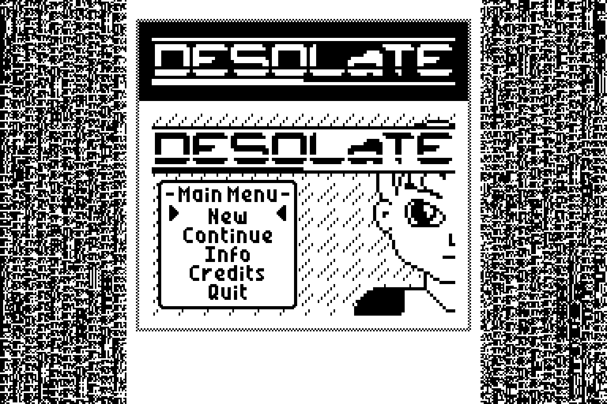
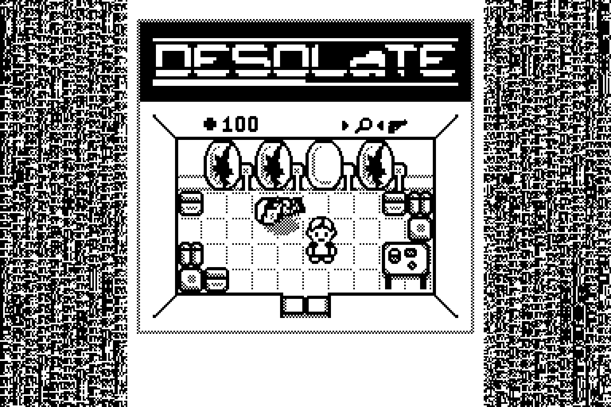

# specialist-desolate
Ported **Desolate** game to Specialist.

Status: released.

Thanks a lot to tr1p1ea for the original game!
Thanks to CityAceE and other [zx-pk.ru forum](https://zx-pk.ru/forum.php) members for all the help and support!

## На русском

Это порт игры **Desolate** на компьютер Специалист.
Порт сделан в 2024 году на основе кода игры для Вектор-06Ц.

Оригинальная игра была написана для калькуляторов TI 83/84, это сделал Патрик Пендергаст (Patrick Prendergast, tr1p1ea) в 2004 году.
В 2000 году я портировал эту игру на ZX Spectrum, Вектор-06Ц и УКНЦ.

Спасибо за помощь и поддержку CityAceE и другим участникам [форума zx-pk.ru](https://zx-pk.ru/forum.php)!

## Инструменты
При создании игры использовались следующие инструменты:

* `tools\bin2rks.py`: скрипт на Python для получения .RKS файла, взят у CityAceE
* `tools\pasmo.exe`: кросс-ассемблер http://pasmo.speccy.org/
* `tools\salvador.exe`: компрессор формата ZX0 https://github.com/emmanuel-marty/salvador/releases
* VSCode в качестве основного редактора кода
* Эмулятор Emu80qt для эмуляции компьютера Специалист

## Ссылки

* [Обсуждение на zx-pk.ru](https://zx-pk.ru/threads/35591-desolate-dlya-spetsialista.html)
* [Порт Desolate для Вектор-06Ц](https://github.com/nzeemin/vector06c-desolate)
